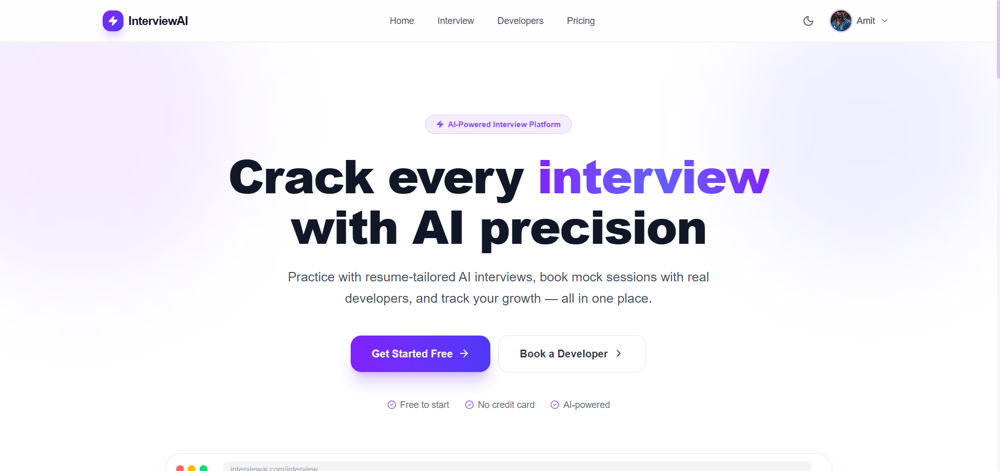
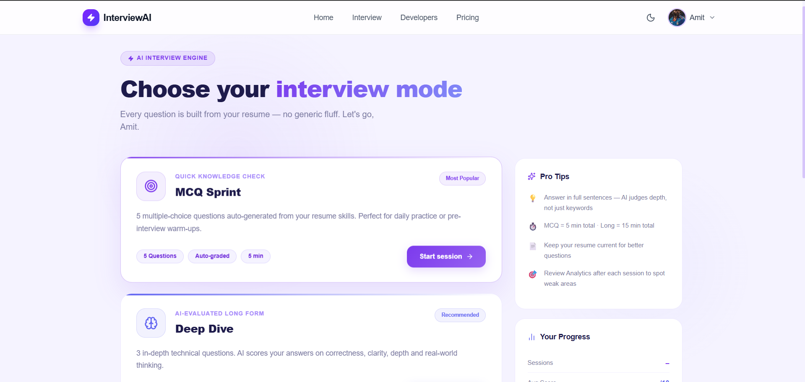
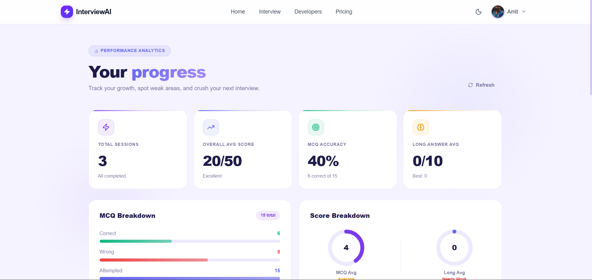

<div align="center">


<br /><br />


# InterviewAI

### *AI-Powered Interview Ecosystem — Practice. Improve. Get Hired.*

A full-stack platform combining **AI-driven mock interviews**, **real developer booking**, **resume intelligence**, and **performance analytics** into one seamless product.

</div>

---

## 📸 Screenshots

### 🏠 Home — Hero Section


### 🎯 Interview Hub — Mode Selection


### 📊 Analytics Dashboard


---

## ✨ Features at a Glance

| Feature | Description | Status |
|---|---|---|
| 🧠 **AI MCQ Interview** | 5 resume-tailored multiple choice questions, auto-graded | ✅ Live |
| 🔍 **AI Deep Dive** | 3 long-form questions with AI scoring on depth, clarity & correctness | ✅ Live |
| 💬 **Live AI Chat** | Full conversational interview that adapts in real time | ✅ Live |
| 📄 **Resume Intelligence** | PDF upload → AI parsing → structured skills/projects/experience extraction | ✅ Live |
| 📅 **Developer Booking** | Browse & book real senior developers for mock sessions | ✅ Live |
| 📊 **Performance Analytics** | Per-user dashboards with MCQ accuracy, score trends, weak area detection | ✅ Live |
| 👤 **Profile Management** | Avatar upload, bio, social links, role-based access | ✅ Live |
| ⏱️ **Session Timer** | MCQ = 5 min / Long = 15 min countdown with auto-submit | ✅ Live |
| 🔐 **JWT Auth** | Access + refresh token system with HttpOnly cookies | ✅ Live |
| 🌗 **Dark / Light Mode** | Full theme system with localStorage persistence | ✅ Live |
| 🎙️ **Voice AI** | Speech-to-text answer evaluation | 🚧 Coming Soon |
| 💳 **Payments** | Razorpay integration for developer session booking | 🚧 Coming Soon |

---

## 🏗️ Tech Stack

### Backend
```
Node.js + Express     → REST API server
MongoDB + Mongoose    → Database & ODM
Groq (LLaMA 3.3 70B) → AI question generation, evaluation & summaries
JWT                   → Authentication (access + refresh tokens)
ImageKit              → Resume PDF & avatar file storage
pdf-parse             → PDF text extraction
bcryptjs              → Password hashing
```

### Frontend
```
React 19 + Vite       → SPA framework & bundler
React Router v6       → Client-side routing
Redux Toolkit         → Global auth state management
Axios                 → HTTP client with interceptors
GSAP + ScrollTrigger  → Animations & scroll effects
Tailwind CSS v4       → Utility-first styling
Lucide React          → Icon library
Poppins (Google)      → Typography
```

---

## 📁 Project Structure

```
AI_Interview/
├── backend/
│   ├── server.js
│   └── src/
│       ├── app.js                        # Express wiring & route mounting
│       ├── config/
│       │   ├── db.js                     # MongoDB connection
│       │   └── groq.js                   # Groq AI client
│       ├── controllers/
│       │   ├── aiTest.controller.js      # MCQ / Long interview logic
│       │   ├── liveInterview.controller.js
│       │   ├── availability.controller.js
│       │   ├── booking.controller.js
│       │   ├── resume.controller.js
│       │   └── user.controller.js
│       ├── middlewares/
│       │   ├── auth.middleware.js
│       │   ├── role.middleware.js
│       │   ├── uploadImage.middleware.js
│       │   └── rateLimit.middleware.js
│       ├── models/
│       │   ├── aiTest.model.js
│       │   ├── liveInterview.model.js
│       │   ├── availability.model.js
│       │   ├── booking.model.js
│       │   ├── resume.model.js
│       │   └── user.model.js
│       ├── routes/
│       │   ├── aiTest.routes.js
│       │   ├── liveInterview.routes.js
│       │   ├── booking.routes.js
│       │   ├── resume.routes.js
│       │   └── user.routes.js
│       └── services/
│           ├── aiQuestion.service.js     # Question generation from resume
│           ├── aiEvaluation.service.js   # Free-text answer scoring
│           ├── aiSummary.service.js      # Session summary generation
│           ├── liveSummary.service.js
│           ├── aiResume.service.js       # Resume structuring
│           ├── resumeParser.service.js   # PDF text extraction
│           └── upload.service.js        # ImageKit file upload
│
└── frontend/
    └── src/
        ├── App.jsx                       # Router + theme + Redux provider
        ├── main.jsx
        ├── index.css                     # Tailwind v4 + Poppins
        ├── app/
        │   ├── store.js                  # Redux store
        │   └── authSlice.js              # Auth state + thunks
        ├── context/
        │   └── AuthContext.jsx           # Thin Redux compatibility layer
        ├── utils/
        │   └── api.js                    # Axios instance
        ├── components/
        │   ├── Navbar.jsx
        │   └── Footer.jsx
        └── pages/
            ├── Home.jsx
            ├── Login.jsx
            ├── Signup.jsx
            ├── Interview.jsx             # Mode selection hub
            ├── InterviewSession.jsx      # Live quiz with timer
            ├── Analytics.jsx
            ├── Developers.jsx
            ├── Pricing.jsx
            └── Profile.jsx
```

---

## 🚀 Quick Start

### Prerequisites

- Node.js **18+**
- MongoDB (local or Atlas)
- Groq API key ([free at console.groq.com](https://console.groq.com))
- ImageKit account (for file uploads)

---

### 1. Clone the Repository

```bash
git clone https://github.com/your-username/ai-interview.git
cd ai-interview
```

---

### 2. Backend Setup

```bash
cd backend
npm install
```

Create `backend/.env`:

```env
PORT=5000
MONGO_URI=mongodb://localhost:27017/ai_interview

# JWT
ACCESS_TOKEN_SECRET=your_access_secret_here
REFRESH_TOKEN_SECRET=your_refresh_secret_here
ACCESS_TOKEN_EXPIRES_IN=15m
REFRESH_TOKEN_EXPIRES_IN=7d

# Groq AI
GROQ_API_KEY=your_groq_api_key_here

# ImageKit
IMAGEKIT_PUBLIC_KEY=your_public_key
IMAGEKIT_PRIVATE_KEY=your_private_key
IMAGEKIT_URL_ENDPOINT=https://ik.imagekit.io/your_id
```

Start the server:

```bash
# Development (with nodemon)
npm run dev

# Production
npm start
```

API runs at → `http://localhost:5000/api/v1`

---

### 3. Frontend Setup

```bash
cd frontend
npm install
```

Create `frontend/.env`:

```env
VITE_API_BASE=http://localhost:5000/api/v1
```

Ensure `src/utils/api.js` uses:

```js
import axios from "axios";
const api = axios.create({
  baseURL: import.meta.env.VITE_API_BASE || "http://localhost:5000/api/v1",
  withCredentials: true,
});
export default api;
```

Start the dev server:

```bash
npm run dev
```

Frontend runs at → `http://localhost:5173`

---

## 🔌 API Reference

### Auth  `/api/v1/auth`

| Method | Endpoint | Auth | Description |
|--------|----------|------|-------------|
| POST | `/register` | — | Register a new user |
| POST | `/login` | — | Login, sets HttpOnly cookies |
| POST | `/logout` | ✅ | Clear cookies |
| GET | `/profile` | ✅ | Fetch current user |
| PUT | `/profile/basic` | ✅ | Update name / password |
| PUT | `/profile/social` | ✅ | Update GitHub / LinkedIn |
| PUT | `/profile/extras` | ✅ | Update bio / avatar (multipart) |

### Resume  `/api/v1`

| Method | Endpoint | Auth | Description |
|--------|----------|------|-------------|
| POST | `/resume/upload` | ✅ | Upload PDF → parse → AI structure |
| PUT | `/resume/upload` | ✅ | Replace existing resume |
| GET | `/resume/get` | ✅ | Fetch user's current resume |

### AI Tests  `/api/v1/aiTest`

| Method | Endpoint | Auth | Description |
|--------|----------|------|-------------|
| POST | `/start` | ✅ | Start a new MCQ or Long session |
| POST | `/:id/answer` | ✅ | Submit an answer for current question |
| GET | `/:id` | ✅ | Fetch test by ID |
| GET | `/history` | ✅ | All sessions for current user |
| GET | `/analytics` | ✅ | Aggregated performance analytics |

### Live Interview  `/api/v1/live_interview`

| Method | Endpoint | Auth | Description |
|--------|----------|------|-------------|
| POST | `/start` | ✅ | Begin a live chat session |
| POST | `/:id/message` | ✅ | Send a message |
| POST | `/:id/end` | ✅ | End session & generate summary |

### Booking  `/api/v1`

| Method | Endpoint | Auth | Role |
|--------|----------|------|------|
| POST | `/availability` | ✅ | Developer | Create slots |
| GET | `/availability/:devId` | — | — | View developer slots |
| POST | `/booking` | ✅ | Fresher | Book a slot |
| PUT | `/booking/:id/cancel` | ✅ | Both | Cancel booking |
| GET | `/booking/my` | ✅ | Fresher | My bookings |

---

## 🧠 AI Architecture

```
User uploads Resume
       │
       ▼
PDF Parse (pdf-parse)
       │
       ▼
AI Resume Structuring (Groq → LLaMA 3.3 70B)
       │  Extracts: skills, projects, experience, education
       ▼
Role Detection
       │  (react → frontend / node → backend / else → fullstack)
       ▼
┌──────────────────────────────────────────┐
│           Interview Mode                 │
│                                          │
│  MCQ   → 5 questions → local grading     │
│  Long  → 3 questions → AI evaluation     │
│  Live  → chat loop  → AI responds        │
└──────────────────────────────────────────┘
       │
       ▼
Score + Feedback + Summary → MongoDB → Analytics
```

---

## 📊 Analytics Data Shape

The backend `GET /aiTest/analytics` returns:

```json
{
  "totalInterviews": 3,
  "overallAvgScore": 20,
  "mcq": {
    "totalQuestions": 15,
    "attempted": 15,
    "correct": 6,
    "wrong": 9,
    "accuracy": 40,
    "averageScore": 4
  },
  "long": {
    "totalQuestions": 0,
    "averageScore": 0,
    "bestScore": 0,
    "lowestScore": 0
  },
  "insights": {
    "strongArea": "MCQ",
    "weakArea": "Long Answer"
  }
}
```

---

## 🔐 Security

- Passwords hashed with **bcryptjs** (10 rounds)
- Refresh tokens **hashed before storage** in DB
- Tokens stored in **HttpOnly cookies** (not localStorage)
- **Role-based middleware** on all sensitive routes (`fresher` / `developer`)
- **Atomic slot locking** on booking to prevent race conditions
- **Rate limiting** on resume upload endpoints (max 2/min per user)
- Input validation on all controllers

---

## 🗺️ Roadmap

- [x] AI MCQ + Long Answer interviews
- [x] Live conversational AI interview
- [x] Resume parsing + AI structuring
- [x] Developer booking & availability system
- [x] Performance analytics dashboard
- [x] Dark / Light theme
- [x] Session timer with auto-submit
- [ ] Razorpay payment integration
- [ ] Voice AI (speech-to-text answers)
- [ ] WebRTC video mock interviews
- [ ] Real-time notifications (Socket.io)
- [ ] PDF report export
- [ ] Redis caching + BullMQ job queues
- [ ] Rating & review system
- [ ] AI avatar interviewer (3D)

---

## 🤝 Contributing

1. Fork the repository
2. Create a feature branch: `git checkout -b feat/your-feature`
3. Commit your changes: `git commit -m "feat: add your feature"`
4. Push to the branch: `git push origin feat/your-feature`
5. Open a Pull Request

Please follow the existing code style (Poppins font, violet/indigo palette, inline styles for components) and test your changes before submitting.

---

## 📄 License

This project is licensed under the **MIT License** — see the [LICENSE](./LICENSE) file for details.

---

<div align="center">

Built with ❤️ by **Amit**

⭐ Star this repo if you found it useful!

</div>